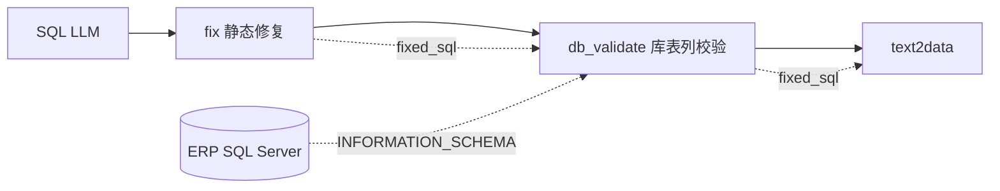

# ERP 自然语言 → SQL 工作流优化说明

本文档总结 ERP Dify 工作流架构、与 MES 的对照关系及维护方式。**所有 ERP 配置均在 `读取ERP配置维表/`，与 MES 完全隔离。**

---

## 1. 总体架构

采用 **「代码预筛 + LLM 终选 + 代码拼 schema」** 分层（与 MES 同构）：

```
用户问题 sys.query
    │
    ▼
┌──────────────────────────────┐
│ 代码：输出表名清单 (v1)         │  672 张 → 约 15~45 张候选
│ dify_erp_table_catalog.py     │  输出 table_catalog
└──────────────┬───────────────┘
               │
               ▼
┌──────────────────────────────┐
│ LLM：分析业务表                 │  从候选清单终选
│ dify_erp_table_select_system_prompt.md │
│ 输出精简 JSON tables           │
└──────────────┬───────────────┘
               │
               ▼
┌──────────────────────────────┐
│ 代码：按表拼 schema             │  毫秒级，替代知识库
│ dify_erp_schema_by_tables.py  │  输出 context
└──────────────┬───────────────┘
               │
               ▼
    dimension / sql_rules / datetime          ← 循环外：读 DB rule_list
               │
               ▼
         SQL LLM → fix_sql → db_validate → text2data
               │                ↑
               │         连 ERP 库删不存在列（207 兜底）
               │
               └── 报错（循环内）→ tiqu_error_rule → conversation.add_rules
                                    └→ dify_erp_sql_rules_db_write.py → erp_sql_rules
```

**分工原则**

| 层级 | 职责 | 不做 |
|------|------|------|
| 代码预排序 | 缩小候选范围、意图加权、补全主从表 | 替代 LLM 做最终业务判断 |
| LLM 选表 | 语义消歧（制造订单 vs 工单、主表 vs 明细） | 读全量 672 张表 |
| 代码 schema | 按选中表嵌入字段说明 | — |
| SQL LLM | 生成 SQL | 选表 |

---

## 2. 选表阶段

### 2.1 精简表清单（Catalog Slim）

- **来源**：`中络项目ERP 系统表名清单V1.0.md`
- **格式**：每表一行 `TableName | 中文表名 | 业务含义`
- **实现**：`erp_table_catalog.py` → `build_erp_catalog_bundle.py` → `dify_erp_table_catalog.py`

### 2.2 通用预排序（Rank）

- **实现**：`erp_table_catalog_rank.py`
- **方法**：中文 n-gram + 英文 token 打分；Top-N（默认 40）作为 LLM 候选
- **意图加权**（无硬编码表映射，仅加分/降权）：
  - 制成品接收 → `FGI_ReceiptItem` / `FGI_Receipt`
  - 制造订单 → `P_MO` / `P_MOSO`
  - 工单 → `P_WO`；过数 → `P_OutPut`
  - 采购 → `M_PurchaseOrderItem` / `M_PurchaseOrder`
  - 请购 → `M_Requisitions`；MRB → `P_MRBRequisition`
- **关联表补全**：主表选中后自动补 `*Item` 明细表

### 2.3 LLM SYSTEM 提示词

- **文件**：`dify_erp_table_select_system_prompt.md`
- **候选清单**：`{{#输出表名清单.table_catalog#}}` 动态注入
- **消歧**：制造订单 vs 工单、接收主表 vs 明细、禁止 MES `TBL_*` 表名

---

## 3. Schema 与 SQL 阶段

### 3.1 按表拼 schema

- **文件**：`dify_erp_schema_by_tables.py`（由 `build_erp_schema_bundle.py` 生成）
- **入参**：`tables_json` / `table_names` / `tables`；可选 **`fact_table` + `join_tables`**（来自维表节点，最小表集）；**`max_tables`**（默认 8）
- **瘦身**：去掉「关联关系」段；LLM 选表 JSON 按 **score 取 Top-N**；维表 `join_tables` 优先于 LLM 全量表

**推荐 workflow 顺序（进一步减 prompt）**：

```
选表 LLM → 维表节点 → schema 节点（fact_table + join_tables）→ SQL LLM
```

schema 节点入参：`fact_table={{#维表节点.fact_table#}}`，`join_tables={{#维表节点.join_tables#}}`（可不传 `tables_json`）。

### 3.2 维表映射

- **维护入口**：`erp_dimension_joins.map`
- **代码节点**：`dify_erp_dimension_node.py`
- **出参**：`dimension_rules`（接 SQL LLM 的维表映射变量）
- **默认精简规则**（`[全局] 默认精简规则=是`）：列表类问句默认 **仅有中文表头的展示列 + 枚举**，维表 JOIN 按需；用户说「明细/全部字段」才出 schema 全列

### 3.3 SQL 执行前修复（两层）

```
SQL LLM 输出
    │
    ▼
┌─────────────────────────────┐
│ ① 静态 fix（必加）            │  dify_erp_sql_fix_node.py
│ NOLOCK / 枚举 / 已知表路由    │  不连库，规则表 + 文档索引
└──────────────┬──────────────┘
               │ fixed_sql
               ▼
┌─────────────────────────────┐
│ ② 库表列校验（强烈推荐）       │  dify_erp_sql_db_validate_node.py
│ INFORMATION_SCHEMA 删不存在列 │  连 ERP 库，207 最终兜底
└──────────────┬──────────────┘
               │ fixed_sql
               ▼
         rookie_text2data
```

| 层级 | 节点 | 数据来源 | 典型场景 |
|------|------|----------|----------|
| ① 静态 fix | `dify_erp_sql_fix_node.py` | 本地 json/map 嵌入 | NOLOCK、外协→S_OS_PO、材料销售表 |
| ② 库表校验 | `dify_erp_sql_db_validate_node.py` | **现场 SQL Server** | `M_PurchaseOrder.supplierId` 等文档缺失/LLM 编造列 |

**依赖（Dify 沙箱）**：`pip install sqlalchemy pymssql`（与 text2data 相同）

**库表校验行为**：

- 解析 SQL 中 `dbo.表` 与别名，批量查 `INFORMATION_SCHEMA.COLUMNS`
- 剔除 SELECT / JOIN ON / WHERE / ORDER BY 中引用**不存在**的 `别名.列`
- 出参 `removed_columns`（JSON）便于调试；`validate_error` 非空时**原样放行** SQL（连库失败不阻断）

**连接参数**（与 text2data 同一 ERP 库）：

| 入参 | 或环境变量 |
|------|------------|
| `server` | `ERP_DB_SERVER` |
| `port` | `ERP_DB_PORT` |
| `username` | `ERP_DB_USER` |
| `password` | `ERP_DB_PASSWORD` |
| `database` | `ERP_DB_DATABASE` |

构建：`python3 build_erp_sql_db_validate_bundle.py`（已含在 `build_all.py`）



### 3.4 SQL 约束规则（PostgreSQL · 独立表 `erp_sql_rules`）

**两层规则（你的设计）**：

| 变量 | 位置 | 来源 | 用途 |
|------|------|------|------|
| `rule_list` | **循环外** | `dify_erp_sql_rules_db_read.py` | DB 已积累的 learned，接【规则约束】 |
| `add_rules` | **循环内** | 报错提取 → `conversation.add_rules` | 本轮重试即时规则，接【新增约束规则】 |

- **读取（循环外）**：`dify_erp_sql_rules_db_read.py` → **`rule_list`**（仅 learned；base 在 SYSTEM + 约束 md）
- **写入（循环内，报错后）**：`tiqu_error_rule` → `dify_erp_sql_rules_db_write.py`（持久化）+ 更新 **`conversation.add_rules`**（当轮 LLM 立即读）
- **维护**：`seed_erp_sql_rules.py` / `seed_erp_sql_learned_rules.py`；打包见 `build_erp_sql_rules_db_bundle.py`

### 3.5 SQL 静态修复（fix 节点）

- **文件**：`dify_erp_sql_fix_node.py`（LLM 之后、库表校验之前，**必加**）
- **修复项**：NOLOCK 拆行、P_MO.status string CASE、主从 JOIN 缺 TOP 补 `TOP (1000)`、已知表误用（如材料销售/外协采购）

### 3.6 多表 TOP (1000)

- **Dify 硬约束**：明细查询必须 `SELECT TOP (1000)`
- **代码**：`erp_sql_multijoin.py`（维表节点注入排序提示；fix 节点兜底补 TOP）

---

## 4. 关键文件清单

| 文件 | 用途 |
|------|------|
| `中络项目ERP 系统表名清单V1.0.md` | 表清单源数据 |
| `中络项目ERP 系统数据库表结构V1.0.md` | 表结构源数据 |
| `erp_table_catalog.py` / `erp_table_catalog_rank.py` | 精简 catalog + 预排序 |
| `build_erp_catalog_bundle.py` | → `dify_erp_table_catalog.py` |
| `dify_erp_table_select_system_prompt.md` | LLM 选表 SYSTEM |
| `erp_schema_by_tables.py` | 按表拼 schema |
| `build_erp_schema_bundle.py` | → `dify_erp_schema_by_tables.py` |
| `erp_dimension_joins.map` | 维表映射维护入口 |
| `build_dify_bundle.py` | → `dify_erp_dimension_node.py` + `dify_erp_sql_fix_node.py` |
| `sql_db_validate_core.py` | ERP/MES 共用：连库校验多表列、删不存在字段 |
| `erp_sql_db_validate.py` | ERP 薄封装（`ERP_DB_*`） |
| `build_erp_sql_db_validate_bundle.py` | → `dify_erp_sql_db_validate_node.py` |
| `中络项目ERP 生成SQL提示词.md` | SQL 生成 LLM SYSTEM |
| `dify_current_datetime.py` | 北京时间 |
| `build_all.py` | 一键打包 |

---

## 5. Dify 节点接线

| 节点 | 入参 | 出参 |
|------|------|------|
| 输出表名清单 | `user_question` = `{{#sys.query#}}` | `table_catalog` |
| 分析业务表 LLM | SYSTEM = `dify_erp_table_select_system_prompt.md` | JSON `tables` |
| 表结构 | `tables_json` = LLM text；或 **`fact_table` + `join_tables`** = 维表节点 | `context` |
| 维表映射 | `user_question` | `dimension_rules`, **`fact_table`**, **`join_tables`** |
| 读取约束规则 | 无（**循环外**） | `rule_list` →【规则约束】 |
| 当前时间 | 无 | `current_datetime` |
| SQL 生成 LLM | SYSTEM = `中络项目MES ERP生成SQL提示词.md` | SQL |
| 报错提取 | error_message | `rule_text` → 更新 `conversation.add_rules` |
| 写入学习规则 | `rule_text`, `error_msg`（**循环内**） | 持久化到 `erp_sql_rules` |
| SQL 静态修复 | `query_sql` + `user_question` | `fixed_sql` → **库表校验入参** |
| **SQL 库表列校验** | `fixed_sql` + `server/port/user/password/database` | `fixed_sql` → **text2data**；`removed_columns`；`validate_error` |
| rookie_text2data | `fixed_sql`（来自库表校验，勿接 LLM 原始 sql） | 查询结果 |

**重试循环内**：每一轮 LLM 输出仍须经过 **fix → db_validate → text2data** 整条链路。

---

## 6. 维护流程

### 6.1 日常（改完配置）

```bash
cd 读取ERP配置维表
python3 build_all.py
```

复制下列 `dify_erp_*.py` 到 Dify 并 **发布** workflow：

1. `dify_erp_table_catalog.py`
2. `dify_erp_schema_by_tables.py`
3. `dify_erp_dimension_node.py`
4. `dify_erp_sql_fix_node.py`
5. `dify_erp_sql_rules_db_read.py` / `write`（若用规则库）
6. **`dify_erp_sql_db_validate_node.py`**（fix 与 text2data 之间，推荐）

### 6.2 表清单 / 表结构 / 维表

| 变更 | 手改文件 | build 脚本 |
|------|----------|------------|
| 新表/业务含义 | `中络项目ERP 系统表名清单V1.0.md` | `build_erp_catalog_bundle.py` |
| 字段/关联 | `中络项目ERP 系统数据库表结构V1.0.md` | `build_erp_schema_bundle.py` |
| JOIN/中文列 | `erp_dimension_joins.map` | `build_dify_bundle.py` |

### 6.3 提示词

- 选表：改 `dify_erp_table_select_system_prompt.md` → 粘 Dify LLM SYSTEM
- SQL：改 `中络项目MES ERP生成SQL提示词.md` → 粘 SQL LLM SYSTEM
- **无需**跑 build 脚本

---

## 7. 设计约束

1. **LLM 保留终选权**：代码只做预筛与加速
2. **与 MES 隔离**：不共用 `.map`/build 脚本；不引用 `TBL_*` 表
3. **TOP (1000) 不可省略**：Dify token 上限
4. **提示词与运维文档分离**：LLM SYSTEM 不含 Dify 接线说明

---

## 8. 与 MES 对照

| 能力 | MES | ERP |
|------|-----|-----|
| 目录 | `读取MES配置维表/` | `读取ERP配置维表/` |
| 表清单 | V1.2 · ~177 张 | V1.0 · ~672 张 |
| 选表节点 | `dify_mes_table_catalog.py` | `dify_erp_table_catalog.py` |
| Schema 节点 | `dify_mes_schema_by_tables.py` | `dify_erp_schema_by_tables.py` |
| 维表节点 | `dify_mes_dimension_node.py` | `dify_erp_dimension_node.py` |
| SQL 库表列校验 | — | `dify_erp_sql_db_validate_node.py` |
| 一键 build | `build_all.py` | `build_all.py` |
| SQL 提示词 | `中络项目MES MES生成SQL提示词.md` | `中络项目MES ERP生成SQL提示词.md` |

---

## 9. 本地验证

```bash
cd 读取ERP配置维表

# 预排序抽样
python3 -c "
from erp_table_catalog import load_catalog_text, slim_catalog_text
from erp_table_catalog_rank import rank_catalog_lines
slim = slim_catalog_text(load_catalog_text())
for q in ['制成品接收明细', '制造订单', '采购订单明细']:
    _, n, mode = rank_catalog_lines(q, slim)
    print(q, mode, n)
"

# 维表规则
python3 erp_dimension_rules.py --question "查制成品接收明细"
```

---

## 10. 常见问题

**Q：改了 `.map` 但 Dify 没变化？**  
A：须跑 `build_all.py`，全文替换 `dify_erp_dimension_node.py`，并 **发布** workflow。

**Q：LLM 选了 MES 表名？**  
A：检查是否用了 ERP workflow；SYSTEM 中已禁止 `TBL_*`。

**Q：明细查询 token 超限？**  
A：确认 SQL 含 `TOP (1000)`；fix 节点已接 `user_question`。

**Q：报错 `Invalid column name`（207）？**  
A：① 确认已接 **fix + 库表校验** 两节点，text2data 用最后一节 `fixed_sql`；② 看 `removed_columns` 是否删列；③ `validate_error` 非空说明连库失败，检查与 text2data 相同的 `server/database`；④ 文档缺字段的表（如 `M_PurchaseOrder`）优先靠库表校验兜底。

**Q：库表校验会改坏正确 SQL 吗？**  
A：只删 **INFORMATION_SCHEMA 中不存在** 的 `别名.列`；连库失败时**不改 SQL**。复杂表达式内误伤极少，可用 `removed_columns` 排查。
